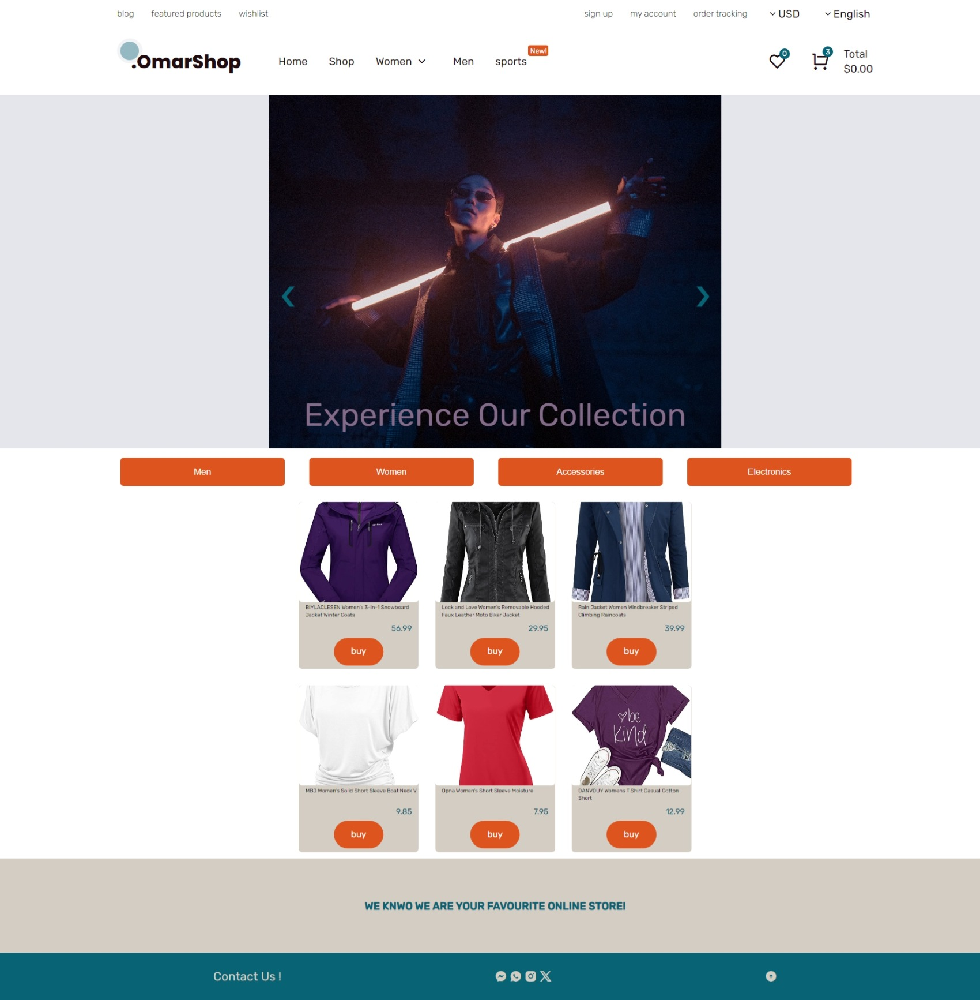

# Ecommerce website Project

a front-end website for an e-commerce platform using HTML, CSS, and JavaScript. The website had a user-friendly interface, responsive design, and dynamic functionality. This project was part of the ITI curriculum .

# Live preview
https://omarmosleh.github.io/ECommerceProject/ 
# Design

